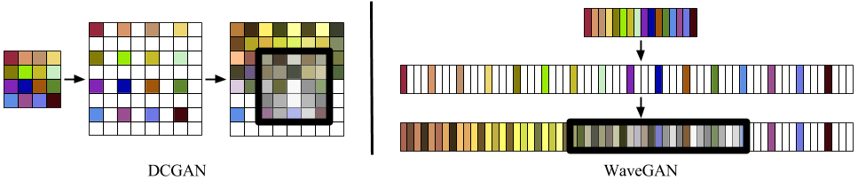
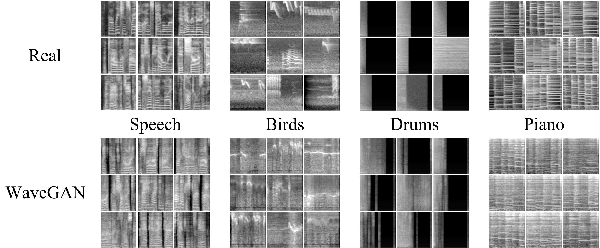

# WaveGAN (v2)

Official implementation of **WaveGAN**, a machine learning algorithm which learns to generate raw audio waveforms.

**UPDATE (2/2/19)**: We have made substantial improvements to this repository in response to common requests:
- **Added streaming data loader allowing you to train a WaveGAN on MP3s/WAVs/OGGs/etc. without preprocessing**
- **Added ability to train WaveGANs capable of generating longer audio examples (up to 4 seconds at 16kHz)**
- Added support for any audio sample rate
- Added support for multi-channel audio
- Compatibility with Python 3 and Tensorflow 1.12.0
- Old (v1) version still available at [this tag](https://github.com/chrisdonahue/wavegan/tree/v1)



This is the official TensorFlow implementation of WaveGAN (Donahue et al. 2018) ([paper](https://arxiv.org/abs/1802.04208)) ([demo](https://chrisdonahue.com/wavegan)) ([sound examples](http://wavegan-v1.s3-website-us-east-1.amazonaws.com)). WaveGAN is a machine learning algorithm which learns to synthesize raw waveform audio by observing many examples of real audio. WaveGAN is comparable to the popular DCGAN approach (Radford et al. 2016) for learning to generate images.

In this repository, we include an implementation of WaveGAN capable of learning to generate up to 4 seconds of audio at 16kHz. For comparison, we also include an implementation of SpecGAN, an approach to audio generation which applies image-generating GANs to image-like audio spectrograms.



WaveGAN is capable of learning to synthesize audio in many different sound domains. In the above figure, we visualize real and WaveGAN-generated audio of speech, bird vocalizations, drum sound effects, and piano excerpts. These sound examples and more can be heard [here](http://wavegan-v1.s3-website-us-east-1.amazonaws.com).

## Requirements

```
pip install tensorflow-gpu==1.12.0
pip install scipy==1.0.0
pip install matplotlib==3.0.2
pip install librosa==0.6.2
```

## Datasets

WaveGAN can now be trained on datasets of arbitrary audio files (previously required preprocessing). You can use any folder containing audio, but here are a few example datasets to help you get started:

- [Speech Commands Zero through Nine (SC09)](http://deepyeti.ucsd.edu/cdonahue/wavegan/data/sc09.tar.gz)
- [Drum sound effects](http://deepyeti.ucsd.edu/cdonahue/wavegan/data/drums.tar.gz)
- [Bach piano performances](http://deepyeti.ucsd.edu/cdonahue/wavegan/data/mancini_piano.tar.gz)

## Train a WaveGAN

Here is how you would begin (or resume) training a WaveGAN on random clips from a directory containing longer audio, i.e., more than a few seconds per file:

```
export CUDA_VISIBLE_DEVICES="0"
python train_wavegan.py train ./train \
	--data_dir ./data/dir_with_longer_audio_files
```

If you are instead training on datasets of short sound effects (e.g., SC09 or drum sound effects), you want to use this command:

```
export CUDA_VISIBLE_DEVICES="0"
python train_wavegan.py train ./train \
	--data_dir ./data/sc09/train \
	--data_first_slice \
	--data_pad_end \
	--data_fast_wav
```

Because our codebase buffers audio clips directly from files, it is important to change the data-related command line arguments to be appropriate for your dataset (see [#data-considerations](data considerations below)).

We currently do not support training on multiple GPUs. If your machine has multiple GPUs, make sure to set the `CUDA_VISIBLE_DEVICES` flag as shown above.

While you can *technically* train a WaveGAN on CPU, it is prohibitively slow and not recommended. If you do attempt this, add the flag `--data_prefetch_gpu_num -1`.

### Data considerations

The WaveGAN training script is configured out-of-the-box to be appropriate for training on random slices from a directory containing longer audio files (e.g., songs, a common use case). If you want to train WaveGAN on shorter sound effects, you will almost likely want to use the flag `--data_first_slice` to only extract the first slice from each audio file. If your clips are extremely short (i.e., less than $16384$ samples each as in SC09), you will want to add `--data_pad_end` so that they get zero padded to fill the slice.

If your dataset consists exclusively of "standard" WAV files (16-bit signed PCM or 32-bit float), you can use the flag `--data_fast_wav` which will use `scipy` (faster) to decode your audio instead of `librosa`. This may slightly increase training speed.

If you want to change the generation length, set `--data_slice_len` to `16384`, `32768`, or `65536` to generate that many audio samples. If you choose a larger generation length, you will likely want to reduce the number of model parameters to train more quickly (e.g. `--wavegan_dim 32`). You can also adjust the sampling rate using `--data_sample_rate` which will effectively change the generation length.

If you have stereo (or multi-channel) audio, adjust `--data_num_channels` as needed. If you are modeling more than 2 channels, each audio file must have the exact number of channels specified.

If you want to normalize each audio file before training, set `--data_normalize`.

### Quality considerations

If your results are too noisy, try adding a post-processing filter with `--wavegan_genr_pp`. You may also want to change the amount of or remove phase shuffle using `--wavegan_disc_phaseshuffle 0`. Increasing either the model size (`--wavegan_dim`) or filter length (`--wavegan_kernel_len`) may improve results but will increase training time.

### Monitoring

To run a script that will dump a preview of fixed latent vectors at each checkpoint on the CPU

```
export CUDA_VISIBLE_DEVICES="-1"
python train_wavegan.py preview ./train
```

To back up checkpoints every hour (GAN training may occasionally collapse so it's good to have backups)

```
python backup.py ./train 60
```

To monitor training via tensorboard, use

```
tensorboard --logdir=./train
```

If you are training on the SC09 dataset, this command will (slowly) calculate inception score at each checkpoint

```
export CUDA_VISIBLE_DEVICES="-1"
python train_wavegan.py incept ./train
```

## Train a SpecGAN

The primary focus of this repository is on WaveGAN, our raw audio generation method. For comparison, we also include an implementation of SpecGAN, an approach to generating audio by applying image-generating GANs on image-like audio spectrograms. This implementation only generates spectrograms of one second in length at 16khz.

Before training a SpecGAN, we must first compute mean and variance of each spectrogram bin to use for normalization. This may take a while(you can also measure these statistics on a subset of the data)

```
python train_specgan.py moments ./train \
	--data_dir ./data/dir_with_mp3s \
	--data_moments_fp ./train/moments.pkl
```

To begin (or resume) training on GPU:

```
python train_specgan.py train ./train \
	--data_dir ./data/dir_with_mp3s \
	--data_moments_fp ./train/moments.pkl
```

### Monitoring

To run a script that will dump a preview of fixed latent vectors at each checkpoint on the CPU

```
export CUDA_VISIBLE_DEVICES="-1"
python train_specgan.py preview ./train \
	--data_moments_fp ./train/moments.pkl
```

To back up checkpoints every hour (GAN training will occasionally collapse)

```
python backup.py ./train 60
```

To monitor training via tensorboard, use

```
tensorboard --logdir=./train
```

If you are training on the SC09 dataset, this command will (slowly) calculate inception score at each checkpoint

```
export CUDA_VISIBLE_DEVICES="-1"
python train_specgan.py incept ./train \
	--data_moments_fp ./train/moments.pkl
```

## Generation

The training scripts for both WaveGAN and SpecGAN create simple TensorFlow MetaGraphs for generating audio waveforms, located in the training directory. An example usage is below; see [this Colab notebook](https://colab.research.google.com/drive/1e9o2NB2GDDjadptGr3rwQwTcw-IrFOnm) for additional features.

```py
import tensorflow as tf
from IPython.display import display, Audio

# Load the graph
tf.reset_default_graph()
saver = tf.train.import_meta_graph('infer.meta')
graph = tf.get_default_graph()
sess = tf.InteractiveSession()
saver.restore(sess, 'model.ckpt')

# Create 50 random latent vectors z
_z = (np.random.rand(50, 100) * 2.) - 1

# Synthesize G(z)
z = graph.get_tensor_by_name('z:0')
G_z = graph.get_tensor_by_name('G_z:0')
_G_z = sess.run(G_z, {z: _z})

# Play audio in notebook
display(Audio(_G_z[0, :, 0], rate=16000))
```

## Evaluation

Our [paper](https://arxiv.org/abs/1802.04208) uses Inception score to (roughly) measure model performance. If you plan to *directly* compare to our reported numbers, you should run [this script](https://github.com/chrisdonahue/wavegan/blob/master/eval/inception/score.py) on a directory of 50,000 16-bit PCM WAV files with 16384 samples each.

```
python score.py --audio_dir wavs
```

To reproduce our paper results (9.18 +- 0.04) for the SC09 ([download](http://deepyeti.ucsd.edu/cdonahue/wavegan/data/sc09.tar.gz)) training dataset, run

```
python score.py --audio_dir sc09/train  --fix_length --n 18620
```

## Web code

Under `web`, we also include a JavaScript implementation of WaveGAN (generation only). Using this implementation, we created a [procedural drum machine](https://chrisdonahue.com/wavegan) powered by a WaveGAN trained on drum sound effects.

### Attribution

If you use this code in your research, cite via the following BibTeX:

```
@inproceedings{donahue2019wavegan,
  title={Adversarial Audio Synthesis},
  author={Donahue, Chris and McAuley, Julian and Puckette, Miller},
  booktitle={ICLR},
  year={2019}
}
```
